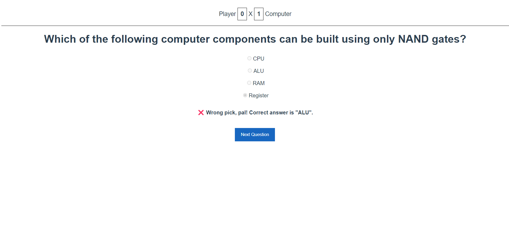

# Simple VUE.js Quizz Game

- Aplicação simples de perguntas e respostas para estudo de Vue utilizando o CLI, requisições com VueAxios e integração de componentes.
- As perguntas foram obtidas na API [Open Trivia Database](https://opentdb.com/api_config.php)

## Instalações

- [Node.js](https://nodejs.org/en/download)
- Yarn: **npm install -g yarn**
- Vue-CLI: **yarn global add @vue/cli**
- Axios: **yarn add axios**
- VueAxios: **yarn add vue-axios**

## Descrição

- São geradas perguntas realizando a busca na API [Open Trivia Database](https://opentdb.com/api_config.php)
- Cada acerto o Player ganha 1 ponto, cada erro o Computer ganha 1 ponto
- Após responder a pergunta, clique Next Question para gerar uma nova pergunta
- Seguem abaixo screenshots da aplicação:
  
 

 

 

 
